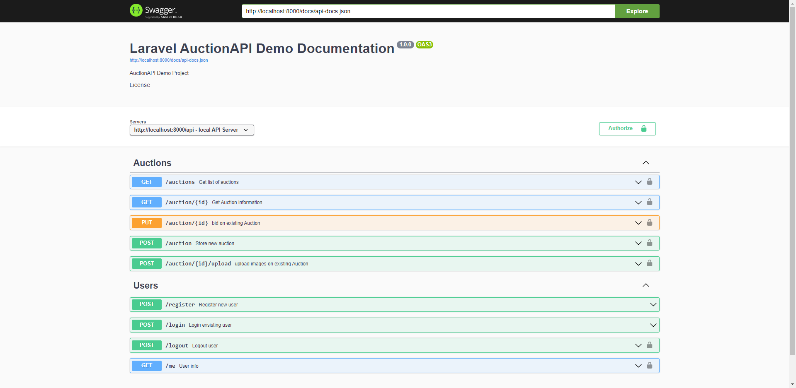

<p align="center">
  

  <h3 align="center">Laravel AuctionAPI</h3>

  <p align="center">
   Laravel demo api app for Auctions .
  </p>
</p>

### Installation

1. Clone the repo
    ```sh
    git clone https://github.com/civilcoder55/AuctionAPI.git
    ```
2. Install packages
    ```sh
    composer update
    ```
3. Rename .env.example to .env and update configurations

4. Run migrations

    ```sh
    php artisan migrate:fresh
    ```

5. Run server

    ```sh
    php artisan serve
    ```

6. Run Queue worker

    ```sh
    php artisan queue:work
    ```

7. Run Schedule worker
    ```sh
    php artisan schedule:work
    ```

## Usage

go to swagger ui and explore endpoints `http://localhost:8000/api/documentation`

swagger ui looks like this:


### Built With

-   [Laravel](https://laravel.com)
